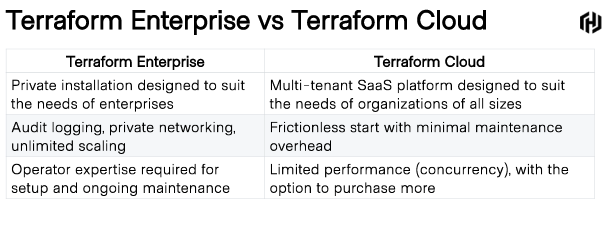
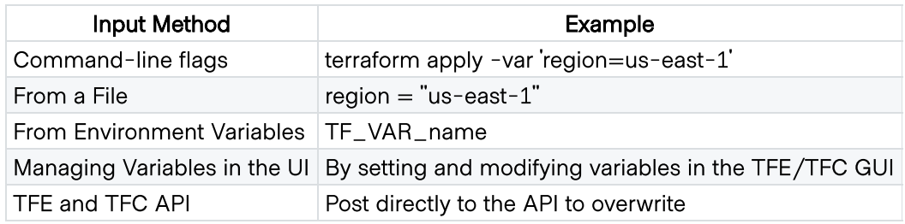

# Terraform

## Terraform Cloud
Platform for teams to **manage Terraform runs** in a *consistent and reliable* environment:
- Shared state & secret data
- Robust RBAC system
- Private registry module
- Sentinel Workflows for policy & control

## Terraform Enterpise
Self-hosted distro of Terraform Cloud. Private instance, not resource limits with: audti logging, 
SAML SSO.

- Battle tested, low risk
- Lower long term maintenance cost
- Familiar across installations
- Backed by enterprise grade support

## Collaboration Features
- VCS (integrate with your existing workflows)
- Workspaces (collection of config file, variables, state data)
- Configuration Designer: GUI to select, combine, define variables & create unique workspaces.

## Goverance & Policy
**Sentinel**: policy as code, fine-grained, logic-based policy decisions.

**SAML for SSO**: govern user access to your apps (Cloud & Enterprise). GUI. RW controls

**Audit**: historical changes. Associate with correlated workspaces (who). Reduced cloud costs.

## Remote State
**State** config:
- Map real world resources
- Metadata tracking

To create plans, determine what exists and changes to be made. Default `terraform.tfstate`.

## Variables

Variables are stored in (Terraform Enterprise) **PostgreSQL** using **Vault Transit Encryption**.

## RBAC for Terraform Enterprise
- **Users**: belong to a team
- **Teams**: orgs create and manage their membership
- **Organizations**: shared spaces for teams.

Permissions: Read, Plan (Queue), Write (Apply runs, edit state), Admin (Manage setings, del workspace)

## SAML SSO
XML-based std for authentication & authorization. Can act as a service provider. Enterprise supports
SAML 2.0. Azure AD, ADFS, Okta, OneLogin