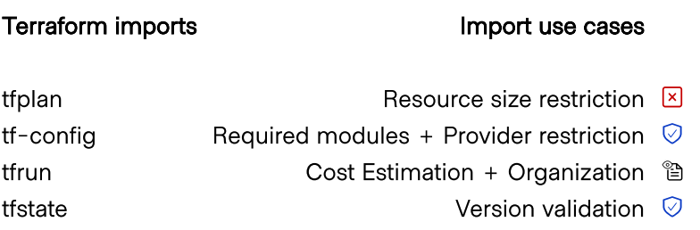
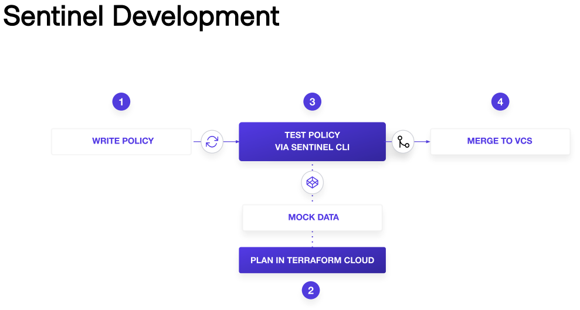

# Sentinel

## Policy as Code
- Policies as apps
- VCS
- Automate enforcement & review
- Automate logic testing
- Proactive vs reactive

## Use Cases
- Security Stds
- Audit Tracking: explicit ownership of resources
- Resource Restriction: limit size of VMs, mandatory tagging, restrict modules

## Mock Data
Generated from existing Terra configs. Exposes data in a Terra plan, state, and config (including 
sensitive values). **REQUIRES SPECIFIC PERMISSION TO ACCESS**

## Process
1. Queue a plan
2. Download *Sentinel mocks* when plan finishes

TFE generates `sentinel.json` automatically.

## Imports


In policies:
- External data
- Similar to libraries or external plugins
- Std & product specific imports

You can filter by:
- Action
- Resource mode
- Resource type

1. Import data
2. Defining parameters
3. Filtering data
4. Aplying rules
5. Determine the result of the policy

## Sentinel Deployment


## Test-driven policy deployment
Why tests?
- Polcies & infra are prone to change
- Making sure that even if changes happen, your policy will still work as intended

How to?
1. Edit data for failing params
2. Confirm passing params
3. Observe trace data for main rule eval in the Sentinel CLI

## Sentinel CLI
Test policies locally:
```sh
sentinel apply -config=mock-data/sentinel.json
```

## `sentinel.hcl`
- Each polciy Terra checks into the set. 
- Any modules that needs.
- Enforcement level.

```hcl
policy "restrict-instance-size" {
    source = "./restrict-instance-size.sentinel"
    enforcement_level = "hard-mandatory"
}
```

## Best practices for Policy Repo Management
Do:
- Descriptive policy names
- Test before merging
- Employ the principle of least privilege for repo members

Don't:
- Push sensitive mock data to VCS
- Merge without testing
- Allow + permissions or users than necessary