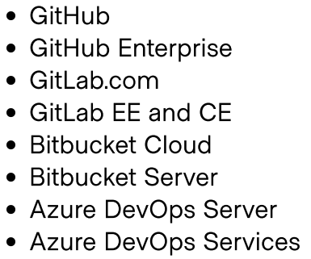

# Collaboration with VCS

## Why?
- Auto initate runs when changes are commited to a branch
- New version only pushing a tag
- Code review easier (auto predicting how pull req will affect)

## Permissions to use VCS
- **List repositories**
- **Register webhooks**
- **Download repository contents**

## WebHook
Run a speculative plan. Manually or auto apply.

## VCS Access
Just provider API & OAuth Token. SSH is necessary:
- Bitbucket Server for downloading repo
- Org repos with Git submodules only accessed via SSH

## VCS Support

## Requirements
VCS:
- Register TFE/TFC org as a new app (ID, key)
- Callback URL
- Approve access req

TFE:
- Tell how to reach VCS, (ID, key, callback URL)
- Request access

## VCS Tunables
- **Auto triggering**: always or specify changes in path
- **VCS Branch**: monitor changes
- **Include submodules on clone** (GitHub)
- **Apply Method**: auto or manual
- **Terraform WD**: relative path where Terraform will exec

## Pipeline
Moving *something* from 1 env to another. Automate assembly, validation, testing
and more. Centralized, autonomous. Repetable tasks. Additional:
- Cost estimation
- Preview of possible changes
- Reviews stages

## Statuses:
- Applied: Success
- No Changes
- Apply Errored: misconfigured provider o illegal operation.
- Plan Errored: Fix to code, or Sentinel policy.
- Discarded
- Canceled

## Sentinel (TFE)
Policy enforcement lang. Checked after `terraform plan`. Examples: restrict 
AZs, Enforce mandatory tags, allow list on `aws_ami`, restrict instance types.

### Enforcement levels
- **Advisory**: warning
- **Soft-Mandatroy**: block non-compliant infra. Admins can override.
- **Hard-Mandatory**: block...

## Modules
Reusable units of Terra code. To create:
- Write code, configure inputs & outputs
- Store the code (accesible)
- Reference your module

## Terraform API
You must:
- (Apps/tools) authenticate with a token to the API
- JSON payloads determine knobs/buttons to be push

Use cases:
- Custom CI pipelines
- Conn with workflow managemts sys
- External sys that need to quert Terra state for data

## Terraform Agents
Allow Terraform to manage **isolated, private infra**
- Pull based arch
- Self-managed **Enterprise** or TF **Business**

U can add extra concurrent run capacity to TFE

Considerations
- Cannot acces private VCS. 
- Agent pool can be targeted by any workspace
- TFC: # of agents is limited by why is pay it
- TFE: no limit
- Network access requirements
